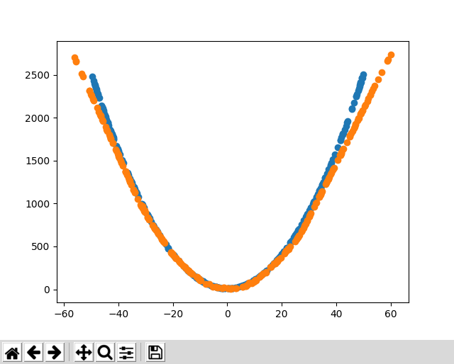

# Lil Ol' GAN

A very basic GAN that I plan to add image support to. For now it takes a generated points made with a function (x^2 for example, a parabola) and generates graphs every 100 training iterations to try to copy it.

Uses a generator and discriminator just like every GAN and works pretty well with these generated points.

Made using Python 3.x and Tensorflow, matplotlib for plotting points
